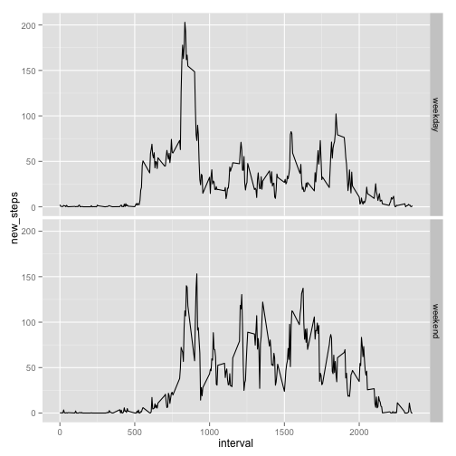

This report is to understand the data from the personal activity monitoring device. We will walk through finding the mean and median of the steps taken per day and also plot data.

**Loading and Processing data**

Load data from the activity csv file

```r
data<-read.csv("activity.csv",stringsAsFactors = FALSE)
```

**What is mean total number of steps taken per day?**


Calculating the total number of steps taken per day

```r
library(plyr)
total<-tapply(data$steps,data$date,FUN=sum,na.rm=FALSE)
```
Histogram representing the total number of steps taken each day

```r
hist(total)
```

 
Reporting the mean and median of the total number of steps taken per day

```r
mean(total,na.rm=TRUE)
```

```
## [1] 10766.19
```

```r
median(total,na.rm=TRUE)
```

```
## [1] 10765
```

**What is the average daily activity pattern?**


Calculating the average number of steps per interval per day

```r
avgd<-tapply(data$steps,data$interval,FUN=mean,na.rm=TRUE)
avgd<-data.frame(cbind(rownames(avgd),avgd))
colnames(avgd)<-c("interval","interval_avg")
avgd$interval_avg <- as.numeric(as.character(avgd$interval_avg))
avgd$interval <- as.numeric(as.character(avgd$interval))
```
Plotting the time series type l plot of the 5-minute interval (x-axis) and the average number of steps taken, averaged across all days (y-axis)


```r
plot(avgd$interval,avgd$interval_avg,type="l",xlab="Intervals",ylab="Avg number of steps")
```

 

Max nummber of steps on average across all the days in the dataset


```r
max(avgd$interval_avg)
```

```
## [1] 206.1698
```

**Imputing missing values**


Calculating the total number of rows with missing values

```r
nrow(data[!complete.cases(data),])
```

```
## [1] 2304
```

Replacing missing values with mean for that 5 minute interval. 


```r
imputed<-merge(data,avgd)
imputed$new_steps <- imputed$steps
imputed$new_steps[is.na(imputed$new_steps)] <- imputed$interval_avg
```

```
## Warning in imputed$new_steps[is.na(imputed$new_steps)] <-
## imputed$interval_avg: number of items to replace is not a multiple of
## replacement length
```

Create a new dataset like the original dataset with NA values replaced

```r
newdata<-imputed[,c(1,3,5)]
newdata<-newdata[order(newdata$date,newdata$interval),]
```

#Calculating the total number of steps taken per day


Histogram of the total number of steps taken each day

```r
hist(total_new)
```

 
Reporting the mean and median of the total number of steps taken per day - new dataset

```r
new_mn<-mean(total_new,na.rm=TRUE)
new_mdn<-median(total_new,na.rm=TRUE)
old_mn<-mean(total,na.rm=TRUE)
old_mdn<-median(total,na.rm=TRUE)
```

Impact : New mean and new Median is greater than then old mean and median as missing values have been replaced. 

Creating a factor variable weekday/weekend in dataset.

```r
newdata$dayofweek<-"weekday"
newdata$dayofweek[weekdays(as.Date(newdata$date)) %in% c("Saturday", "Sunday")]<-"weekend" 
```
**Are there differences in activity patterns between weekdays and weekends?**


```r
library(ggplot2)
ggplot(newdata,aes(x=interval,y=new_steps)) +facet_grid(dayofweek~.) + stat_summary(fun.y=mean,geom="line")
```

 
